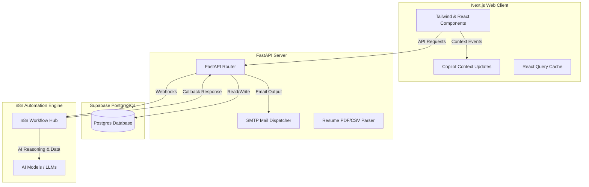

# Kozker Recruiter AI — Project Overview

Kozker Recruiter AI is a premium, modern Applicant Tracking System (ATS) and Recruitment Operations platform. It bridges the gap between recruiters and hiring managers by combining robust recruitment tracking with deep AI-driven automation touchpoints, powered by an underlying FastAPI backend, Next.js frontend, and n8n webhook workflow orchestration.

---

## 🏛️ System Architecture

The platform is designed around a decoupled, service-oriented architecture:

* **Frontend**: Next.js (built with React, Tailwind CSS, Lucide icons, and `@tanstack/react-query` for server state sync).
* **Backend**: FastAPI (Python), utilizing Uvicorn, httpx, and JWT authentication. It handles core API routing, email notifications via SMTP, database transactions, and file/resume uploads.
* **Orchestration**: n8n Webhook Workflow Hub, which acts as the integration gateway to large language models (LLMs) and other third-party services.
* **Database**: Supabase PostgreSQL, containing schemas for profiles, clients, requirements, job openings, candidates, applications, and logs.

---

## 🚀 Key Platform Features & AI Integration Touchpoints

AI is deeply integrated into the platform's lifecycle, automating time-consuming manual recruitment steps. Below is a descriptive breakdown of how features correspond with AI workflows:

### 1. Mandate-to-Job opening Generation
* **Feature**: Recruiters register clients and create "Requirements" (hiring mandates) specifying roles, experience levels, tech stacks, and rough requirements.
* **AI Integration**: 
  * The backend dispatches a webhook (`N8N_GENERATE_JOBS_URL`) containing the mandate details.
  * An AI agent inside n8n drafts a structured, highly professional Job Description (JD) and populates the database as a draft.
  * **AI JD Regeneration**: If a draft needs adjustments, recruiters can trigger an AI-assisted regeneration (`N8N_REGENERATE_JOBS_URL`) with custom prompts (e.g., *"Make it sound more senior and emphasize system architecture skills"*).

### 2. Weighted Skills Extraction
* **Feature**: Standardizes skill requirements across candidates for fair evaluation.
* **AI Integration**:
  * Upon mandate creation, a webhook (`N8N_EXTRACT_SKILLS_URL`) triggers an AI model to extract key hard and soft skills directly from the requirement text.
  * The AI assigns weights (e.g., must-have vs. nice-to-have) to each skill, which recruiters can review, edit, or approve.

### 3. AI Candidate Matching & Scoring
* **Feature**: Automatically ranks candidates uploaded via resumes or imported via CSV files against open jobs.
* **AI Integration**:
  * The resume text is extracted and packaged with the target job description.
  * A matching webhook (`N8N_MATCH_CANDIDATES_URL`) fires to n8n to analyze the candidate's fit against the weighted skills.
  * **Structured AI Outputs**: The AI writes back to the database:
    * **Fuzzy Match Score**: A ranking metric from `0` to `100`.
    * **Strengths**: A list of matches between candidate experience and job criteria.
    * **Skill Gaps**: Areas where the candidate falls short.
    * **AI Reasoning**: A written summary explaining the score to the recruiter.

### 4. Smart Screening Questions
* **Feature**: Automatically designs tailored interview scripts for candidates.
* **AI Integration**:
  * **Tailored Generation**: A webhook (`N8N_GENERATE_QUESTIONS_URL`) generates 5-10 candidate-specific screening questions targeting the exact gaps and strengths identified during matching.
  * **Question Refinement**: If a recruiter adds a custom question or wants to edit one, a webhook (`N8N_REFINE_QUESTION_URL`) refines and structures it using AI to maintain a professional, standardized tone.

### 5. Candidate Q&A Desk
* **Feature**: A portal where candidates can submit questions regarding open roles, stage status, or work policies.
* **AI Integration**:
  * Recruiters review and draft answers directly in the portal.
  * **SMTP Dispatch**: When submitted, the backend triggers an automated SMTP dispatcher sending the response to the candidate. It sets the logged-in recruiter's email as the `Reply-To` and their name as the display sender to route follow-ups directly to the recruiter's mailbox.

### 6. Copilot Real-Time Context Updates
* **Feature**: Provides real-time page awareness to chatbot assistants or copilot modules.
* **AI Integration**:
  * The frontend dispatches a custom browser event (`copilot-context-update`) whenever the recruiter navigates or filters tables.
  * The event payload contains structured state data (e.g., visible rows, active error counts, unread notifications). Any client-side AI copilot instantly knows what the recruiter is looking at, enabling context-aware suggestions.

---

## 🎨 Premium UI/UX Interactions

To deliver a premium dashboard experience, the user interface features sophisticated design patterns:

### Google-Style Timeline Deletions
* **The Interaction**: Recruiters can delete operations timeline entries or alerts.
* **The Animation**: Clicking delete triggers a two-phase CSS transition:
  1. The card slides off to the right (`translateX(100%)`) and fades out smoothly over **350ms**.
  2. Once the card is out of the way, the card's height collapses from `200px` to `0px` over **200ms**, causing the cards below to slide up smoothly.
* **Staggered Bulk Clears**: Clearing all alerts triggers the same slide-off in a staggered cascade (with a `50ms` delay per row) to create a wave-like collapse effect.

### Monochrome Mail Collector Empty State
* **The Interaction**: Shown when the timeline is completely empty.
* **The Animation**: Displays a custom monochrome SVG animation of falling envelopes landing in a desktop document tray, using continuous CSS keyframe animations. It is styled in neutral tones to match a clean, professional aesthetic.
